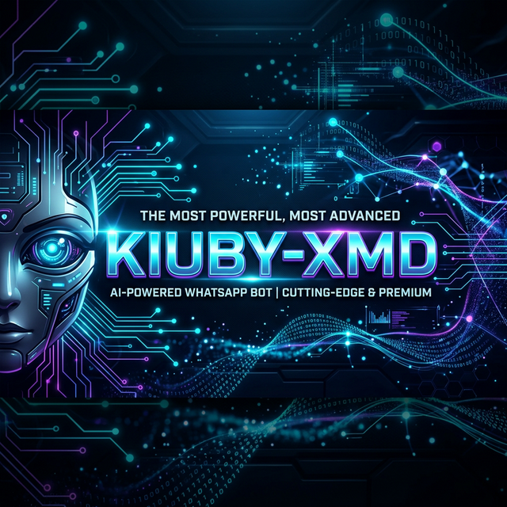

<p align="center">
  
</p>

# 🦾 KIUBY-XMD: The Zenith of WhatsApp Automation

**KIUBY-XMD** isn't just a bot; it's a structural masterpiece of engineering designed to dominate the WhatsApp ecosystem. Engineered with a "Performance-First" philosophy, it melds ultra-fast response times with a suite of lethal features, making it the **most powerful, most advanced** automation tool in existence.

From autonomous AI reasoning to heavy-duty media processing, **KIUBY-XMD** is built to handle the impossible with ease.

---

## ⚡ Core Dominance

-   **🧠 Neural Processing**: Deep integration with GPT-4, Gemini Pro, and DeepSeek. It doesn't just reply; it *remembers* and *analyzes*.
-   **🚀 Mach-Speed Execution**: Optimized asynchronous core built on the latest Baileys socket for zero-latency commands.
-   **🔐 Ironclad Security**: Hardened session management with full encryption support. Your data stays Yours.
-   **🎨 Creative Engine**: Professional-grade image manipulation, dynamic sticker creation, and high-fidelity video processing.
-   **🌍 Omni-Downloader**: One-tap media extraction from YouTube, Instagram, TikTok, Facebook, and SoundCloud.
-   **🛡️ Sovereign Moderation**: Automated group governance with AI-powered anti-spam and link-detection protocols.
-   **💎 Infinite Scalability**: Modular plugin architecture allow for unlimited feature expansion.

---

## 🏗️ Local Installation

Prepare your environment to host the titan:

### **1. Prerequisites**
- **Node.js**: `v20.x` or higher
- **Git**: Installed
- **FFmpeg**: Required for media processing

### **2. Clone & Setup**
```bash
git clone https://github.com/NoxelEcnord/KIUBY-XMD.git
cd KIUBY-XMD
npm install
```

### **3. Configuration**
Create a `config.env` file in the root directory and populate your credentials:
```env
SESSION_ID = "YOUR_SESSION_ID"
OWNER_NUMBER = "YOUR_PHONE_NUMBER"
PREFIX = "."
BOT_NAME = "KIUBY-XMD"
```

---

## 🚀 Launching the Bot

Run the bot with maximum performance:

### **Developer Mode**
```bash
npm run start
```

### **Production Mode (Recommended)**
Use PM2 to keep the bot alive 24/7 with auto-restart:
```bash
npm run bot
```

---

## 📌 One-Click Deployment

Don't want to host it yourself? Deploy instantly:

<p align="center">
  <a href="https://pro.bwmxmd.co.ke" target="_blank">
    
  </a>
  <a href="https://main.bwmxmd.co.ke/Deploy" target="_blank">
    
  </a>
</p>

---

## 📢 Matrix Hub

-   **Official Channel**: [Get Latest Updates](https://whatsapp.com/channel/0029VbAuCjELtOj5n8Lv9h3d)
-   **Support Group**: [Join the Community](https://chat.whatsapp.com/DfmTOy8g2bmHvpg1o4xplG)
-   **Main Site**: [kiuby-xmd.online](https://kiuby-xmd.online)

---

<p align="center">
  <strong>Crafted for Power by <a href="https://github.com/NoxelEcnord">NoxelEcnord</a> | © 2026</strong>
</p>
